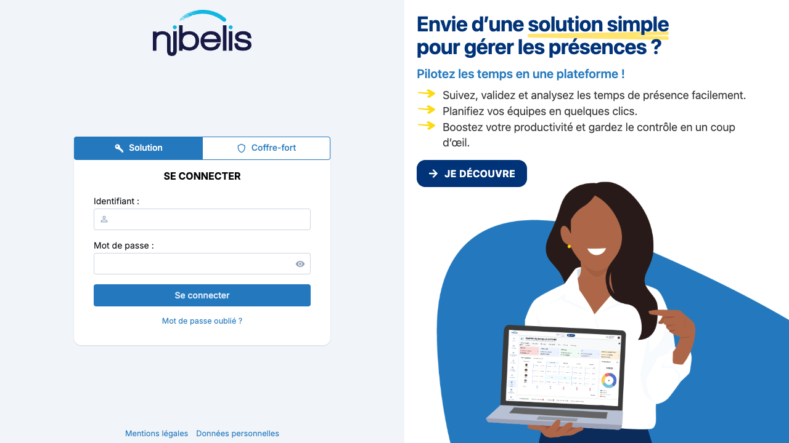
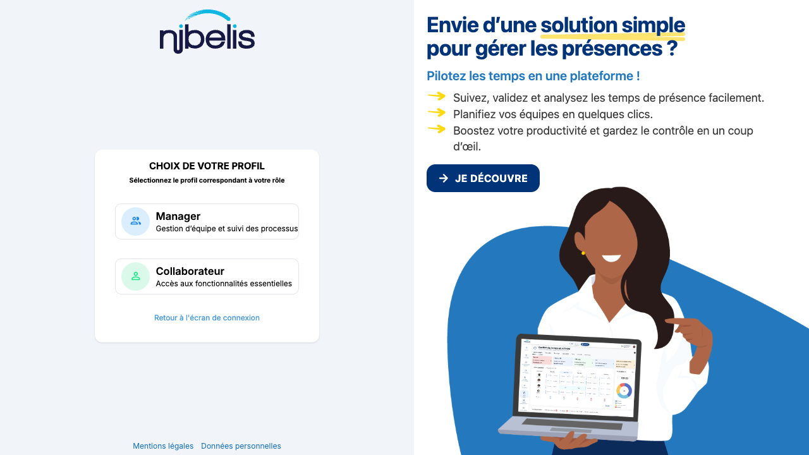
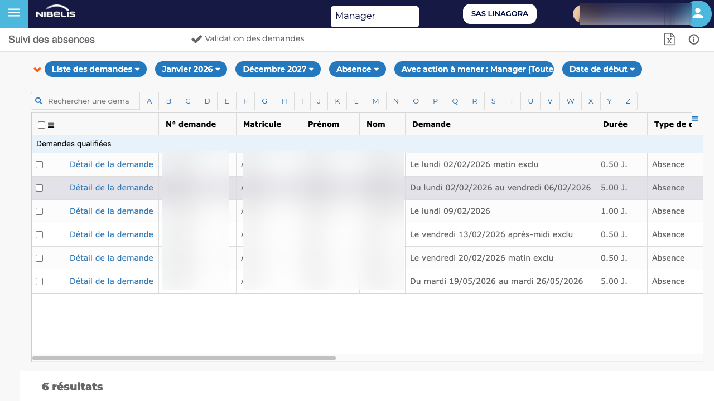

# Captures d'ecran et extraction de donnees

Browserlet permet de capturer des screenshots a chaque etape d'un workflow et d'extraire des donnees structurees depuis des tableaux HTML. Ce guide illustre ces fonctionnalites avec un cas concret : la validation des demandes d'absence dans Nibelis.

---

## Cas d'usage : Nibelis - Validation des absences

Le scenario complet :

1. Se connecter a Nibelis avec un credential du vault
2. Selectionner le profil Manager
3. Naviguer vers le tableau des demandes d'absence en attente
4. Capturer des screenshots a chaque etape cle
5. Extraire le tableau des demandes en JSON structure

---

## Les screenshots pas a pas

### Etape 1 : Page de connexion

Le script ouvre la page de login Nibelis et attend que le formulaire soit pret.

```yaml
- action: navigate
  value: "https://client.nibelis.com/login?ACTION=ACCUEIL&MAJ=N"

- action: wait_for
  target:
    intent: "Formulaire de connexion avec champ Identifiant"
    hints:
      - type: text_contains
        value: "Identifiant"
    fallback_selector: "input.p-inputtext, input[type='text']"
  timeout: "15s"

- action: screenshot
  value: "browserlet-output/nibelis-01-login.png"
```



Le `wait_for` garantit que la page est completement chargee avant la capture. Sans cette attente, le screenshot pourrait capturer une page blanche ou partiellement rendue.

---

### Etape 2 : Choix du profil

Apres authentification, Nibelis presente un ecran de selection de profil. Le script clique sur la carte Manager.

```yaml
- action: type
  target:
    intent: "Champ Identifiant du formulaire de connexion"
    hints:
      - type: role
        value: textbox
      - type: text_contains
        value: "Identifiant"
    fallback_selector: "input.p-inputtext.input"
  value: "Mimaudet"

- action: type
  target:
    intent: "Champ Mot de passe du formulaire de connexion"
    hints:
      - type: type
        value: password
    fallback_selector: "input[type='password']"
  value: "{{credential:Nibelis}}"

- action: click
  target:
    intent: "Bouton Se connecter"
    hints:
      - type: role
        value: button
      - type: text_contains
        value: "Se connecter"
    fallback_selector: "button:has-text('Se connecter')"

- action: wait_for
  target:
    intent: "Page de choix de profil avec carte Manager"
    hints:
      - type: text_contains
        value: "CHOIX DE VOTRE PROFIL"
    fallback_selector: "div.profile-option"
  timeout: "30s"

- action: screenshot
  value: "browserlet-output/nibelis-02-profil.png"
```



Le mot de passe est injecte depuis le vault avec `{{credential:Nibelis}}` -- il n'apparait jamais dans le script ni dans les logs.

---

### Etape 3 : Dashboard Manager

Le dashboard affiche les taches en attente du manager.

```yaml
- action: click
  target:
    intent: "Carte cliquable du profil Manager"
    hints:
      - type: css_class
        value: profile-option
      - type: text_contains
        value: "Manager"
    fallback_selector: "div.profile-option:has-text('Manager')"

- action: wait_for
  target:
    intent: "Dashboard Manager avec section MES TACHES EN ATTENTE"
    hints:
      - type: text_contains
        value: "MES TACHES EN ATTENTE"
    fallback_selector: "text=MES TACHES EN ATTENTE"
  timeout: "30s"

- action: screenshot
  value: "browserlet-output/nibelis-03-dashboard.png"
```


---

### Etape 4 : Tableau des demandes d'absence

Le script navigue directement vers la page de validation des demandes filtree sur les absences en attente.

```yaml
- action: navigate
  value: "https://client.nibelis.com/servlet/ListeEtats?TEMPLATE=RE_ListeDemandeConges&TYPE_DEMA=ABSE&FILT_FORM=O&FILT_DATE_DEBU=01/01/2026&FILT_DATE_FIN=31/12/2027&FILT_SIMP=TODO_RESP&FILT_SALA=TOUS&FILT_DEMA=AVEC&FILT_MOTIFABS=TOUS&ETAT_STAT=ATTE&ACCU=O&SESS_APPVUE=N"

- action: wait_for
  target:
    intent: "Tableau des demandes d'absence"
    hints:
      - type: role
        value: table
      - type: text_contains
        value: "N° demande"
    fallback_selector: "table"
  timeout: "20s"

- action: screenshot
  value: "browserlet-output/nibelis-04-demandes.png"
```



Le tableau affiche 6 demandes en attente de validation avec les colonnes : N° demande, Matricule, Prenom, Nom, Demande, Duree, Type.

---

## Extraction de donnees avec `table_extract`

### Syntaxe

L'action `table_extract` cible un tableau HTML et retourne ses donnees sous forme de JSON structure (headers + rows).

```yaml
- action: table_extract
  target:
    intent: "Tableau des demandes d'absence avec colonnes N° demande, Matricule, Prenom, Nom, Demande, Duree, Type"
    hints:
      - type: role
        value: table
      - type: text_contains
        value: "N° demande"
    fallback_selector: "table"
  output:
    variable: demandes_absence
```

**Points cles :**

- **`target`** : cible le tableau avec les memes hints qu'un `click` ou `wait_for` (intent, hints semantiques, fallback_selector)
- **`output.variable`** : nom de la variable qui recevra les donnees extraites
- La detection fonctionne meme avec des **tableaux splites** (headers dans un `<table>`, donnees dans un autre) -- un pattern frequent dans les applications legacy

### Resultat : `extracted.json`

Apres execution, Browserlet ecrit un fichier `browserlet-output/extracted.json` contenant toutes les variables extraites :

```json
{
  "demandes_absence": {
    "headers": [
      "N° demande",
      "Matricule",
      "Prenom",
      "Nom",
      "Demande",
      "Duree",
      "Type de demande",
      "Type",
      "Repos quot.",
      "CP acquis (sans distinction)",
      "CP restants (sans distinction)",
      "RTT Restants",
      "Commentaire"
    ],
    "rows": [
      {
        "N° demande": "DUPO107",
        "Matricule": "B412",
        "Prenom": "Jean",
        "Nom": "DUPONT",
        "Demande": "Le lundi 02/02/2026 matin exclu",
        "Duree": "0.50 J.",
        "Type de demande": "Absence",
        "Type": "Journee de recuperation",
        "CP acquis (sans distinction)": "20.747",
        "CP restants (sans distinction)": "2.000",
        "RTT Restants": "1.500",
        "Commentaire": "Recuperation reunion projet"
      },
      {
        "N° demande": "MART58",
        "Matricule": "B629",
        "Prenom": "Sophie",
        "Nom": "MARTIN",
        "Demande": "Du lundi 02/02/2026 au vendredi 06/02/2026",
        "Duree": "5.00 J.",
        "Type de demande": "Absence",
        "Type": "Conges payes",
        "CP acquis (sans distinction)": "18.747",
        "CP restants (sans distinction)": "-5.000",
        "RTT Restants": "0.500",
        "Commentaire": ""
      }
    ]
  }
}
```

*(2 lignes sur 6 montrees pour la lisibilite -- donnees anonymisees)*

Le JSON est directement exploitable par un script Python, un pipeline CI, ou une API pour alimenter un tableau de bord ou declencher des alertes.

---

## L'action `screenshot`

### Syntaxe de base

```yaml
- action: screenshot
  value: "browserlet-output/nom-du-fichier.png"
```

Le chemin est relatif au repertoire de travail. Le repertoire parent est cree automatiquement.

### Bonnes pratiques

| Pratique | Explication |
|----------|-------------|
| Toujours preceder d'un `wait_for` | Garantit que la page est chargee avant la capture |
| Nommer avec un prefixe numerote | `nibelis-01-login.png`, `nibelis-02-profil.png`... facilite le tri |
| Capturer aux points cles | Login, navigation, resultat final -- pas a chaque clic |
| Utiliser `gif-frames/` pour les GIF | Le script `make-gif.sh` assemble les frames automatiquement |

### Utilisation pour le debug

Les screenshots sont precieux pour diagnostiquer les echecs. En cas d'erreur sur une etape, le dernier screenshot montre l'etat exact de la page au moment du probleme.

```bash
browserlet run nibelis-absences.bsl --headed --vault --output-dir debug-run/
# En cas d'echec, examiner les PNG dans debug-run/
```

---

## L'action `table_extract` en detail

### Format de sortie

`table_extract` retourne un objet avec deux proprietes :

```typescript
{
  headers: string[];           // Noms des colonnes
  rows: Record<string, string>[]; // Tableau d'objets cle-valeur
}
```

Chaque ligne est un objet dont les cles correspondent aux headers. Par exemple, pour acceder au prenom de la premiere ligne :

```javascript
data.demandes_absence.rows[0]["Prenom"]  // "Jean"
```

### Ciblage du tableau

Le `target` fonctionne comme pour toute autre action BSL :

```yaml
target:
  intent: "Description en langage naturel du tableau"
  hints:
    - type: role
      value: table          # Cible un element <table>
    - type: text_contains
      value: "N° demande"   # Texte present dans le tableau
  fallback_selector: "table" # Selecteur CSS de secours
```

**Ordre de resolution :**

1. Le resolver semantique utilise l'`intent` et les `hints` pour trouver le tableau
2. En cas d'echec, le `fallback_selector` CSS est utilise directement

### Tableaux splites (applications legacy)

Certaines applications (comme Nibelis) utilisent un pattern ou les headers sont dans un `<table>` et les donnees dans un `<table>` different. Browserlet detecte automatiquement ce pattern :

1. Cherche les `<th>` dans le tableau cible pour les headers
2. Si les `<td>` sont absents, cherche dans les tables adjacentes (meme parent)
3. En dernier recours, cherche dans toutes les tables de la page avec un nombre de colonnes similaire

### Variables multiples

Un script peut extraire plusieurs tableaux dans des variables differentes :

```yaml
- action: table_extract
  target:
    intent: "Tableau des demandes en attente"
    fallback_selector: "#table-attente"
  output:
    variable: demandes_attente

- action: table_extract
  target:
    intent: "Tableau des demandes validees"
    fallback_selector: "#table-validees"
  output:
    variable: demandes_validees
```

Les deux variables sont ecrites dans le meme `extracted.json`.

---

## Execution

### Lancer le script

```bash
browserlet run nibelis-absences.bsl --headed --vault
```

### Sortie CLI

```
  Browserlet | Nibelis - Validation des demandes d'absence | 12 steps
  --------------------------------------------------
  ✔   [1/12] navigate (782ms)
  ✔   [2/12] wait_for Formulaire de connexion avec champ Identifiant (155ms)
  ✔   [3/12] type Champ Identifiant (17ms)
  ✔   [4/12] type Champ Mot de passe (32ms)
  ✔   [5/12] click Bouton Se connecter (31ms)
  ✔   [6/12] wait_for Page de choix de profil (1.9s)
  ✔   [7/12] click Carte cliquable du profil Manager (31ms)
  ✔   [8/12] wait_for Dashboard Manager (11.2s)
  ✔   [9/12] navigate (3.3s)
  ✔  [10/12] wait_for Tableau des demandes d'absence (11ms)
  ✔  [11/12] screenshot (2.0s)
  ✔  [12/12] table_extract Tableau des demandes d'absence (4ms)
  [Extracted] browserlet-output/extracted.json

  PASS | completed in 25.6s
```

### Fichiers produits

```
browserlet-output/
  nibelis-validation-demandes.png   # Screenshot du tableau
  extracted.json                    # Donnees extraites en JSON
```

---

## Script complet

Le script complet `nibelis-absences.bsl` avec screenshots et extraction :

```yaml
name: Nibelis - Validation des demandes d'absence
steps:
  - action: navigate
    value: "https://client.nibelis.com/login?ACTION=ACCUEIL&MAJ=N"

  - action: wait_for
    target:
      intent: "Formulaire de connexion avec champ Identifiant"
      hints:
        - type: text_contains
          value: "Identifiant"
      fallback_selector: "input.p-inputtext, input[type='text']"
    timeout: "15s"

  - action: type
    target:
      intent: "Champ Identifiant du formulaire de connexion"
      hints:
        - type: role
          value: textbox
        - type: text_contains
          value: "Identifiant"
      fallback_selector: "input.p-inputtext.input"
    value: "Mimaudet"

  - action: type
    target:
      intent: "Champ Mot de passe du formulaire de connexion"
      hints:
        - type: type
          value: password
      fallback_selector: "input[type='password']"
    value: "{{credential:Nibelis}}"

  - action: click
    target:
      intent: "Bouton Se connecter"
      hints:
        - type: role
          value: button
        - type: text_contains
          value: "Se connecter"
      fallback_selector: "button:has-text('Se connecter')"

  - action: wait_for
    target:
      intent: "Page de choix de profil avec carte Manager"
      hints:
        - type: text_contains
          value: "CHOIX DE VOTRE PROFIL"
      fallback_selector: "div.profile-option"
    timeout: "30s"

  - action: click
    target:
      intent: "Carte cliquable du profil Manager"
      hints:
        - type: css_class
          value: profile-option
        - type: text_contains
          value: "Manager"
      fallback_selector: "div.profile-option:has-text('Manager')"

  - action: wait_for
    target:
      intent: "Dashboard Manager avec section MES TACHES EN ATTENTE"
      hints:
        - type: text_contains
          value: "MES TACHES EN ATTENTE"
    timeout: "30s"

  - action: navigate
    value: "https://client.nibelis.com/servlet/ListeEtats?TEMPLATE=RE_ListeDemandeConges&..."

  - action: wait_for
    target:
      intent: "Tableau des demandes d'absence"
      hints:
        - type: role
          value: table
        - type: text_contains
          value: "N° demande"
      fallback_selector: "table"
    timeout: "20s"

  - action: screenshot
    value: "browserlet-output/nibelis-validation-demandes.png"

  - action: table_extract
    target:
      intent: "Tableau des demandes d'absence avec colonnes N° demande, Matricule, Prenom, Nom, Demande, Duree, Type"
      hints:
        - type: role
          value: table
        - type: text_contains
          value: "N° demande"
      fallback_selector: "table"
    output:
      variable: demandes_absence
```

---

## Aide-memoire

### Actions de capture et extraction

| Action | Description | Sortie |
|--------|-------------|--------|
| `screenshot` | Capture la page en PNG | Fichier image |
| `table_extract` | Extrait un tableau HTML en JSON | `extracted.json` |
| `extract` | Extrait du texte depuis un element | `extracted.json` |

### Flags utiles

| Flag | Description |
|------|-------------|
| `--headed` | Navigateur visible (voir les screenshots en temps reel) |
| `--vault` | Active le vault pour `{{credential:...}}` |
| `--output-dir <dir>` | Repertoire de sortie pour screenshots et JSON |
| `--timeout <ms>` | Timeout par etape (defaut : 30000) |
