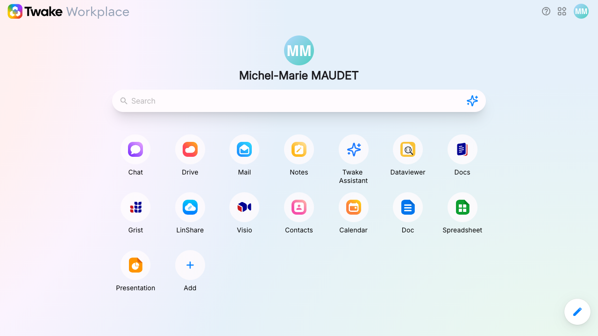
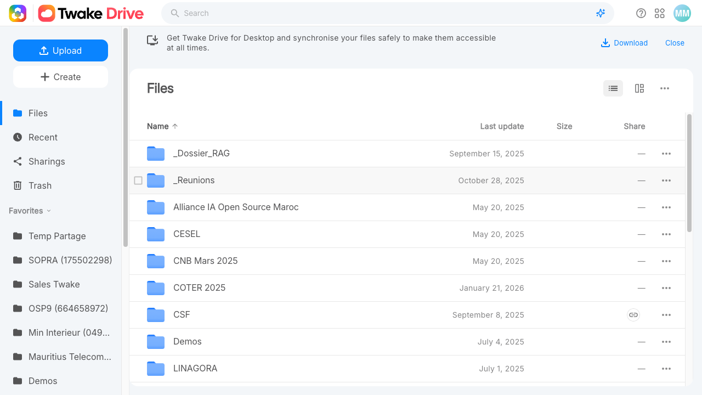
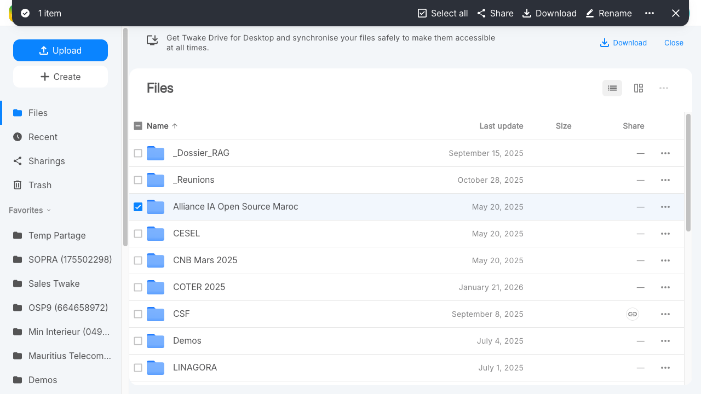

# Guide d'utilisation Browserlet

Browserlet permet d'automatiser des workflows web en 3 temps :

1. **Enregistrer** un credential (mot de passe) dans l'extension Chrome
2. **Enregistrer** un scenario d'actions depuis l'extension
3. **Rejouer** ce scenario en ligne de commande (CLI)

Ce guide vous accompagne pas a pas, de l'extension au terminal.

---

## Prerequis

| Element | Detail |
|---------|--------|
| Extension Browserlet | Installee et activee dans Chrome |
| CLI Browserlet | Installe (`npm install` depuis le depot) |
| Cle API (optionnelle) | `ANTHROPIC_API_KEY` — necessaire uniquement pour `--micro-prompts` et `--auto-repair` |

---

## Etape 1 : Gerer les credentials dans l'extension

Les credentials permettent de stocker vos mots de passe de maniere chiffree (AES-256-GCM) et de les injecter dans vos scripts sans jamais les exposer en clair.

### 1.1 Ouvrir le side panel

Cliquez sur l'icone Browserlet dans la barre d'extensions Chrome. Le side panel s'ouvre sur le cote droit du navigateur.


### 1.2 Configurer le mot de passe maitre (premiere utilisation)

Lors du premier acces au gestionnaire de credentials, l'extension vous demande de creer un **mot de passe maitre**. Ce mot de passe protege l'ensemble de votre coffre-fort local.


> **Important** : ce mot de passe n'est jamais transmis. Si vous le perdez, les credentials stockes ne sont plus recuperables.

### 1.3 Ajouter un credential

Depuis le gestionnaire de credentials :

1. Cliquez sur **Ajouter un credential**
2. Renseignez les champs :
   - **Alias** : identifiant court utilise dans les scripts (ex. `LINAGORA`)
   - **URL** (optionnel) : site associe
   - **Nom d'utilisateur** (optionnel) : login associe
   - **Mot de passe** : la valeur secrete
3. Validez


### 1.4 Verifier la liste des credentials

La liste affiche les alias enregistres, sans jamais montrer les mots de passe en clair.


### 1.5 Utiliser un credential dans un script

Dans un script BSL, referencez un credential avec la syntaxe :

```yaml
value: "{{credential:ALIAS}}"
```

Par exemple, pour un champ mot de passe :

```yaml
- action: type
  target:
    intent: "Champ mot de passe"
    hints:
      - type: type
        value: password
  value: "{{credential:LINAGORA}}"
```

Le remplacement se fait **uniquement a l'execution** — le mot de passe n'apparait jamais dans le fichier `.bsl` ni dans les logs.

---

## Etape 2 : Enregistrer un scenario

L'extension enregistre vos actions dans le navigateur et genere un script BSL (Browserlet Scripting Language) au format YAML.

### 2.1 Naviguer sur le site cible

Ouvrez le site sur lequel vous souhaitez enregistrer un workflow (ex. `https://twake.linagora.com`).

### 2.2 Demarrer l'enregistrement

Dans le side panel, cliquez sur le bouton **Enregistrer**. Un overlay rouge apparait autour de la page pour indiquer que l'enregistrement est actif.


### 2.3 Effectuer les actions

Realisez les actions que vous souhaitez automatiser :

- **Clic** sur un bouton ou un lien
- **Saisie** de texte dans un champ
- **Navigation** entre les pages
- **Selection** dans un menu deroulant

L'extension capture chaque interaction et genere automatiquement des **hints semantiques** (role, texte, placeholder, label...) pour cibler les elements de maniere resiliente.

### 2.4 Utiliser un credential pour un champ mot de passe

Lorsque vous saisissez un mot de passe, l'extension detecte le champ `type="password"` et vous propose d'associer un credential existant au lieu d'enregistrer la valeur en clair.

Selectionnez l'alias souhaite (ex. `LINAGORA`). Le script generera `{{credential:LINAGORA}}` a la place du mot de passe.

### 2.5 Arreter et visualiser le BSL

Cliquez sur **Arreter** pour terminer l'enregistrement. Le script BSL genere s'affiche dans l'editeur integre du side panel.


Vous pouvez relire et modifier le script directement dans l'editeur avant de l'exporter.

### 2.6 Exporter en fichier .bsl

Cliquez sur **Exporter** pour telecharger le fichier `.bsl` sur votre machine. Placez-le dans votre repertoire de travail.


---

## Etape 3 : Preparer le vault CLI

Le vault CLI est un coffre-fort local (stocke dans `~/.browserlet/vault.json`) qui permet a la CLI de dechiffrer les `{{credential:...}}` a l'execution.

### 3.1 Initialiser le vault

```bash
browserlet vault init
```

Vous serez invite a creer un mot de passe maitre (avec confirmation).


### 3.2 Ajouter un credential

**Methode manuelle** — ajoutez un credential un par un :

```bash
browserlet vault add LINAGORA
```

La CLI demande la valeur du credential (saisie masquee).

**Methode import** — importez tous les credentials depuis l'extension Chrome :

```bash
browserlet vault import-from-extension
```

Cette commande :
- Detecte le profil Chrome contenant l'extension Browserlet
- Demande le mot de passe maitre de l'extension
- Cree le vault CLI s'il n'existe pas encore
- Importe les credentials en detectant les doublons

### 3.3 Verifier les credentials disponibles

```bash
browserlet vault list
```

Affiche la liste des alias (jamais les valeurs en clair).

### Autres commandes vault

| Commande | Description |
|----------|-------------|
| `browserlet vault del <alias>` | Supprimer un credential |
| `browserlet vault lock` | Verrouiller le vault immediatement |
| `browserlet vault reset` | Supprimer entierement le vault |

---

## Etape 4 : Rejouer en CLI

### 4.1 Lancer un script

```bash
browserlet run mon-script.bsl --headed --vault
```

- `--headed` : ouvre un navigateur visible (utile pour le debug ; sans ce flag, le navigateur tourne en mode headless)
- `--vault` : active le dechiffrement des `{{credential:...}}`

### 4.2 Flags principaux

| Flag | Description | Defaut |
|------|-------------|--------|
| `--headed` | Navigateur visible | headless |
| `--vault` | Active le vault pour les credentials | desactive |
| `--timeout <ms>` | Timeout global par etape (ms) | 30000 |
| `--output-dir <dir>` | Repertoire des screenshots et diagnostics | `browserlet-output` |
| `--micro-prompts` | Active les micro-prompts LLM pour la resolution d'elements (necessite `ANTHROPIC_API_KEY`) | desactive |
| `--auto-repair` | Applique automatiquement les reparations suggerees par le LLM (confiance >= 0.70) | desactive |
| `--interactive` | Approuver manuellement chaque reparation (exclusif avec `--auto-repair`) | desactive |
| `--session-restore <id>` | Restaurer une session precedente (sauter l'authentification) | — |
| `--diagnostic-json` | Sortie des diagnostics en JSON structure | desactive |

### 4.3 Lire les resultats

Apres l'execution, la CLI affiche un resume :

- Nombre d'etapes reussies / echouees
- Temps d'execution par etape
- Chemin des screenshots generes

Les screenshots et rapports d'erreur sont enregistres dans le repertoire `--output-dir` (par defaut `browserlet-output/`).


### 4.4 Execution par lot

Pour executer un repertoire entier de scripts :

```bash
browserlet test ./scripts/ --workers 4 --bail
```

| Flag | Description |
|------|-------------|
| `--workers <n>` | Nombre de workers paralleles (defaut : 1) |
| `--bail` | Arreter au premier echec |

---

## Exemple concret : Twake Drive

Voici un script complet qui se connecte a Twake et navigue jusqu'au dossier LINAGORA dans Drive.

### Script `twake-drive.bsl`

```yaml
# Twake Drive - Navigate to LINAGORA directory
#
# Uses the LINAGORA credential from the vault to log in,
# then navigates to Drive > LINAGORA folder.
#
# Run with: browserlet run twake-drive.bsl --headed --vault

name: Twake Drive – LINAGORA folder
steps:
  # Ouvrir la page d'accueil Twake
  - action: navigate
    value: "https://mmaudet-home.twake.linagora.com/"

  # Attendre le formulaire de connexion
  - action: wait_for
    target:
      intent: "Email or username input field on the login page"
      hints:
        - type: role
          value: textbox
      fallback_selector: "input[type='email'], input[type='text'], input[name='username']"
    timeout: "15s"

  # Screenshot de la page de login
  - action: screenshot
    value: "browserlet-output/twake-01-login.png"

  # Saisir le nom d'utilisateur
  - action: type
    target:
      intent: "Username input field"
      hints:
        - type: role
          value: textbox
      fallback_selector: "input[type='email'], input[type='text'], input[name='username']"
    value: "mmaudet"

  # Saisir le mot de passe depuis le vault
  - action: type
    target:
      intent: "Mot de passe input field"
      hints:
        - type: placeholder_contains
          value: "Mot de passe"
      fallback_selector: "input[type='password']"
    value: "{{credential:LINAGORA}}"

  # Cliquer sur Se connecter
  - action: click
    target:
      intent: "Se connecter submit button"
      hints:
        - type: role
          value: button
        - type: text_contains
          value: "Se connecter"
      fallback_selector: "button[type='submit'], input[type='submit']"

  # Attendre le chargement du dashboard
  - action: wait_for
    target:
      intent: "Main Twake application interface loaded"
      hints:
        - type: role
          value: navigation
      fallback_selector: "nav, .sidebar, [class*='sidebar'], [class*='menu']"
    timeout: "20s"

  # Screenshot du dashboard
  - action: screenshot
    value: "browserlet-output/twake-02-dashboard.png"

  # Cliquer sur Drive dans la barre laterale
  - action: click
    target:
      intent: "Drive link or icon in the left sidebar"
      hints:
        - type: role
          value: link
        - type: text_contains
          value: "Drive"
      fallback_selector: "a[href*='drive'], [class*='drive']"

  # Attendre la liste des fichiers
  - action: wait_for
    target:
      intent: "Drive file listing or folder view"
      hints:
        - type: role
          value: list
      fallback_selector: "[class*='file-list'], [class*='folder'], table, [class*='drive']"
    timeout: "15s"

  # Screenshot de Drive
  - action: screenshot
    value: "browserlet-output/twake-03-drive.png"

  # Cliquer sur le dossier LINAGORA
  - action: click
    target:
      intent: "LINAGORA folder in the file listing"
      hints:
        - type: text_contains
          value: "LINAGORA"
      fallback_selector: "[title='LINAGORA'], a:has-text('LINAGORA')"

  # Attendre le contenu du dossier
  - action: wait_for
    target:
      intent: "Contents of the LINAGORA directory"
      hints:
        - type: role
          value: list
      fallback_selector: "[class*='file-list'], [class*='folder'], table"
    timeout: "15s"

  # Screenshot final
  - action: screenshot
    value: "browserlet-output/twake-04-linagora-drive.png"
```

### Lancer le script

```bash
browserlet run twake-drive.bsl --headed --vault
```

### Screenshots de resultat

**Page de login :**


**Dashboard apres connexion :**



**Vue Drive :**



**Dossier LINAGORA :**



---

## Aide-memoire

### Commandes vault

| Commande | Description |
|----------|-------------|
| `browserlet vault init` | Creer le vault avec un mot de passe maitre |
| `browserlet vault add <alias>` | Ajouter un credential |
| `browserlet vault del <alias>` | Supprimer un credential |
| `browserlet vault list` | Lister les alias enregistres |
| `browserlet vault import-from-extension` | Importer depuis l'extension Chrome |
| `browserlet vault lock` | Verrouiller le vault |
| `browserlet vault reset` | Supprimer le vault |

### Flags CLI — `browserlet run`

| Flag | Description |
|------|-------------|
| `--headed` | Navigateur visible |
| `--vault` | Activer le vault |
| `--timeout <ms>` | Timeout par etape |
| `--output-dir <dir>` | Repertoire de sortie |
| `--micro-prompts` | Micro-prompts LLM |
| `--auto-repair` | Reparation automatique |
| `--interactive` | Reparation interactive |
| `--session-restore <id>` | Restaurer une session |
| `--diagnostic-json` | Diagnostics JSON |

### Flags CLI — `browserlet test`

| Flag | Description |
|------|-------------|
| `--workers <n>` | Workers paralleles |
| `--bail` | Arreter au premier echec |
| *(+ tous les flags de `run`)* | |

### Syntaxe credential dans BSL

```yaml
value: "{{credential:MON_ALIAS}}"
```

### Actions BSL disponibles

| Action | Description |
|--------|-------------|
| `navigate` | Ouvrir une URL |
| `click` | Cliquer sur un element |
| `type` | Saisir du texte |
| `select` | Choisir dans un menu deroulant |
| `wait_for` | Attendre un element ou une condition |
| `extract` | Extraire du texte |
| `table_extract` | Extraire un tableau HTML |
| `screenshot` | Capturer la page |
| `hover` | Survoler un element |
| `scroll` | Defiler vers un element |
