# Guide d'utilisation Browserlet

Browserlet permet d'automatiser des workflows web en 3 temps :

1. **Enregistrer** un credential (mot de passe) dans l'extension Chrome
2. **Enregistrer** un scénario d'actions depuis l'extension
3. **Rejouer** ce scénario en ligne de commande (CLI)

Ce guide vous accompagne pas à pas, de l'extension au terminal.

---

## Prérequis

| Élément | Détail |
|---------|--------|
| Extension Browserlet | Installée et activée dans Chrome |
| CLI Browserlet | Installé (`npm install` depuis le dépôt) |
| Clé API (optionnelle) | `ANTHROPIC_API_KEY` — nécessaire uniquement pour `--micro-prompts` et `--auto-repair` |

---

## Étape 1 : Gérer les credentials dans l'extension

Les credentials permettent de stocker vos mots de passe de manière chiffrée (AES-256-GCM) et de les injecter dans vos scripts sans jamais les exposer en clair.

### 1.1 Ouvrir le side panel

Cliquez sur l'icône Browserlet dans la barre d'extensions Chrome. Le side panel s'ouvre sur le côté droit du navigateur.

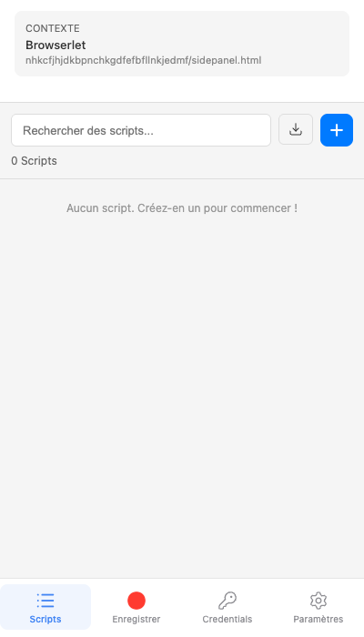

### 1.2 Configurer le mot de passe maître (première utilisation)

Lors du premier accès au gestionnaire de credentials, l'extension vous demande de créer un **mot de passe maître**. Ce mot de passe protège l'ensemble de votre coffre-fort local.

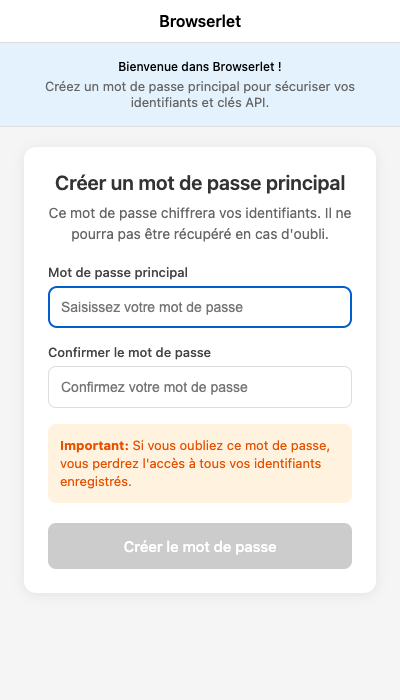

> **Important** : ce mot de passe n'est jamais transmis. Si vous le perdez, les credentials stockés ne sont plus récupérables.

### 1.3 Ajouter un credential

Depuis le gestionnaire de credentials :

1. Cliquez sur le bouton **+** (vert) à côté de « Stored Credentials »
2. Le **mode capture** s'active : naviguez sur un site et saisissez vos identifiants
3. L'extension détecte automatiquement les champs de login
4. Cliquez sur **Arrêter** pour valider les credentials capturés

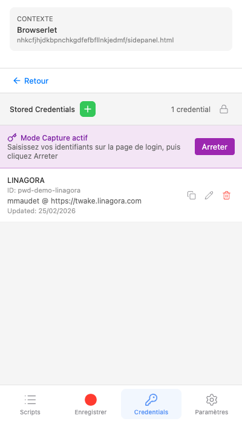

### 1.4 Vérifier la liste des credentials

La liste affiche les alias enregistrés, sans jamais montrer les mots de passe en clair.

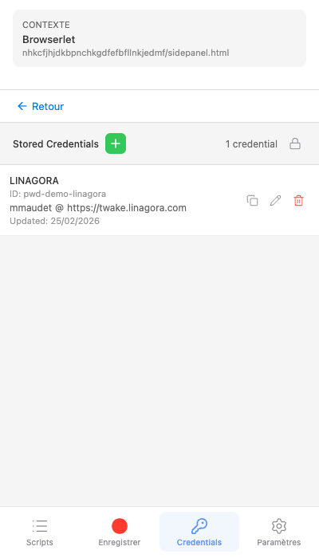

### 1.5 Utiliser un credential dans un script

Dans un script BSL, référencez un credential avec la syntaxe :

```yaml
value: "{{credential:ALIAS}}"
```

Par exemple, pour un champ mot de passe :

```yaml
- action: type
  target:
    intent: "Champ mot de passe"
    hints:
      - type: type
        value: password
  value: "{{credential:LINAGORA}}"
```

Le remplacement se fait **uniquement à l'exécution** — le mot de passe n'apparaît jamais dans le fichier `.bsl` ni dans les logs.

---

## Étape 2 : Enregistrer un scénario

L'extension enregistre vos actions dans le navigateur et génère un script BSL (Browserlet Scripting Language) au format YAML.

### 2.1 Naviguer sur le site cible

Ouvrez le site sur lequel vous souhaitez enregistrer un workflow (ex. `https://twake.linagora.com`).

### 2.2 Démarrer l'enregistrement

Dans le side panel, cliquez sur le bouton **Démarrer l'enregistrement**. Un badge rouge « REC » apparaît en haut à droite de la page pour indiquer que l'enregistrement est actif.

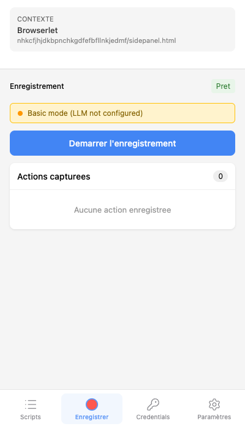

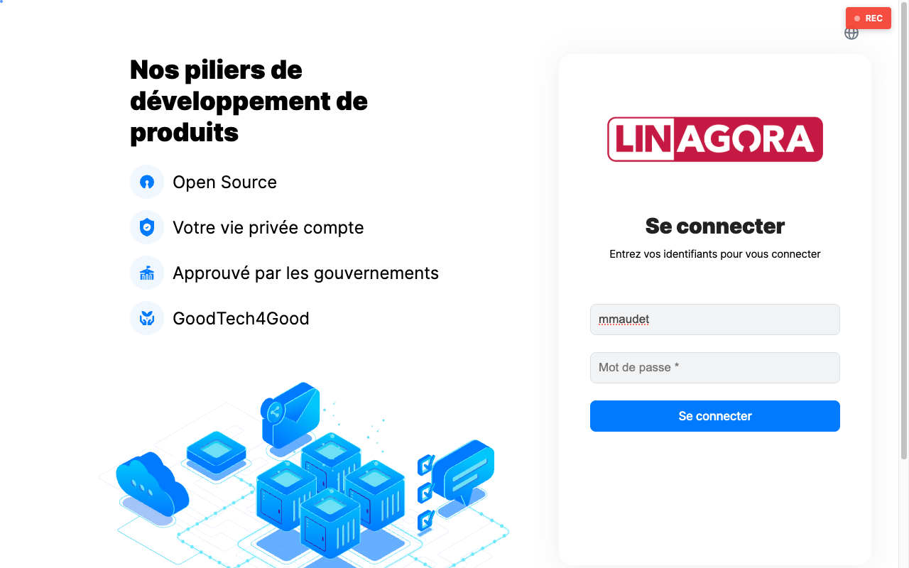

### 2.3 Effectuer les actions

Réalisez les actions que vous souhaitez automatiser :

- **Clic** sur un bouton ou un lien
- **Saisie** de texte dans un champ
- **Navigation** entre les pages
- **Sélection** dans un menu déroulant

L'extension capture chaque interaction et génère automatiquement des **hints sémantiques** (rôle, texte, placeholder, label...) pour cibler les éléments de manière résiliente.

### 2.4 Utiliser un credential pour un champ mot de passe

Lorsque vous saisissez un mot de passe, l'extension détecte le champ `type="password"` et vous propose d'associer un credential existant au lieu d'enregistrer la valeur en clair.

Sélectionnez l'alias souhaité (ex. `LINAGORA`). Le script générera `{{credential:LINAGORA}}` à la place du mot de passe.

### 2.5 Arrêter et visualiser le BSL

Cliquez sur **Arrêter l'enregistrement** pour terminer. Le script BSL généré s'affiche dans l'éditeur intégré du side panel.

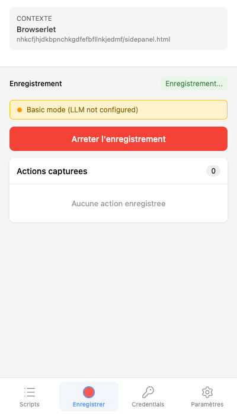


Vous pouvez relire et modifier le script directement dans l'éditeur avant de l'exporter.

### 2.6 Exporter en fichier .bsl

Cliquez sur **Exporter** pour télécharger le fichier `.bsl` sur votre machine. Placez-le dans votre répertoire de travail.

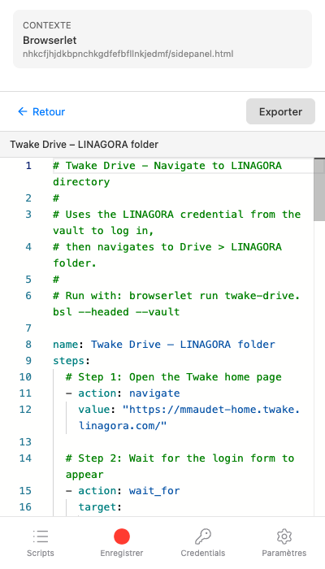

---

## Étape 3 : Préparer le vault CLI

Le vault CLI est un coffre-fort local (stocké dans `~/.browserlet/vault.json`) qui permet à la CLI de déchiffrer les `{{credential:...}}` à l'exécution.

### 3.1 Initialiser le vault

```bash
browserlet vault init
```

Vous serez invité à créer un mot de passe maître (avec confirmation).

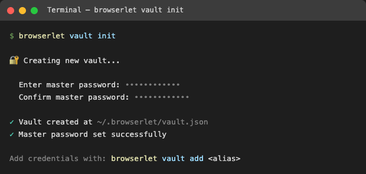

### 3.2 Ajouter un credential

**Méthode manuelle** — ajoutez un credential un par un :

```bash
browserlet vault add LINAGORA
```

La CLI demande la valeur du credential (saisie masquée).

**Méthode import** — importez tous les credentials depuis l'extension Chrome :

```bash
browserlet vault import-from-extension
```

Cette commande :
- Détecte le profil Chrome contenant l'extension Browserlet
- Demande le mot de passe maître de l'extension
- Crée le vault CLI s'il n'existe pas encore
- Importe les credentials en détectant les doublons

### 3.3 Vérifier les credentials disponibles

```bash
browserlet vault list
```

Affiche la liste des alias (jamais les valeurs en clair).

### Autres commandes vault

| Commande | Description |
|----------|-------------|
| `browserlet vault del <alias>` | Supprimer un credential |
| `browserlet vault lock` | Verrouiller le vault immédiatement |
| `browserlet vault reset` | Supprimer entièrement le vault |

---

## Étape 4 : Rejouer en CLI

### 4.1 Lancer un script

```bash
browserlet run mon-script.bsl --headed --vault
```

- `--headed` : ouvre un navigateur visible (utile pour le debug ; sans ce flag, le navigateur tourne en mode headless)
- `--vault` : active le déchiffrement des `{{credential:...}}`

### 4.2 Flags principaux

| Flag | Description | Défaut |
|------|-------------|--------|
| `--headed` | Navigateur visible | headless |
| `--vault` | Active le vault pour les credentials | désactivé |
| `--timeout <ms>` | Timeout global par étape (ms) | 30000 |
| `--output-dir <dir>` | Répertoire des screenshots et diagnostics | `browserlet-output` |
| `--micro-prompts` | Active les micro-prompts LLM pour la résolution d'éléments (nécessite `ANTHROPIC_API_KEY`) | désactivé |
| `--auto-repair` | Applique automatiquement les réparations suggérées par le LLM (confiance >= 0.70) | désactivé |
| `--interactive` | Approuver manuellement chaque réparation (exclusif avec `--auto-repair`) | désactivé |
| `--session-restore <id>` | Restaurer une session précédente (sauter l'authentification) | — |
| `--diagnostic-json` | Sortie des diagnostics en JSON structuré | désactivé |

### 4.3 Lire les résultats

Après l'exécution, la CLI affiche un résumé :

- Nombre d'étapes réussies / échouées
- Temps d'exécution par étape
- Chemin des screenshots générés

Les screenshots et rapports d'erreur sont enregistrés dans le répertoire `--output-dir` (par défaut `browserlet-output/`).

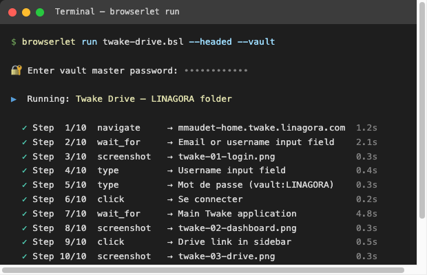

### 4.4 Exécution par lot

Pour exécuter un répertoire entier de scripts :

```bash
browserlet test ./scripts/ --workers 4 --bail
```

| Flag | Description |
|------|-------------|
| `--workers <n>` | Nombre de workers parallèles (défaut : 1) |
| `--bail` | Arrêter au premier échec |

---

## Exemple concret : Twake Drive

Voici un script complet qui se connecte à Twake et navigue jusqu'au dossier LINAGORA dans Drive.

### Script `twake-drive.bsl`

```yaml
# Twake Drive - Navigate to LINAGORA directory
#
# Uses the LINAGORA credential from the vault to log in,
# then navigates to Drive > LINAGORA folder.
#
# Run with: browserlet run twake-drive.bsl --headed --vault

name: Twake Drive – LINAGORA folder
steps:
  # Ouvrir la page d'accueil Twake
  - action: navigate
    value: "https://mmaudet-home.twake.linagora.com/"

  # Attendre le formulaire de connexion
  - action: wait_for
    target:
      intent: "Email or username input field on the login page"
      hints:
        - type: role
          value: textbox
      fallback_selector: "input[type='email'], input[type='text'], input[name='username']"
    timeout: "15s"

  # Screenshot de la page de login
  - action: screenshot
    value: "browserlet-output/twake-01-login.png"

  # Saisir le nom d'utilisateur
  - action: type
    target:
      intent: "Username input field"
      hints:
        - type: role
          value: textbox
      fallback_selector: "input[type='email'], input[type='text'], input[name='username']"
    value: "mmaudet"

  # Saisir le mot de passe depuis le vault
  - action: type
    target:
      intent: "Mot de passe input field"
      hints:
        - type: placeholder_contains
          value: "Mot de passe"
      fallback_selector: "input[type='password']"
    value: "{{credential:LINAGORA}}"

  # Cliquer sur Se connecter
  - action: click
    target:
      intent: "Se connecter submit button"
      hints:
        - type: role
          value: button
        - type: text_contains
          value: "Se connecter"
      fallback_selector: "button[type='submit'], input[type='submit']"

  # Attendre le chargement du dashboard
  - action: wait_for
    target:
      intent: "Main Twake application interface loaded"
      hints:
        - type: role
          value: navigation
      fallback_selector: "nav, .sidebar, [class*='sidebar'], [class*='menu']"
    timeout: "20s"

  # Screenshot du dashboard
  - action: screenshot
    value: "browserlet-output/twake-02-dashboard.png"

  # Cliquer sur Drive dans la barre latérale
  - action: click
    target:
      intent: "Drive link or icon in the left sidebar"
      hints:
        - type: role
          value: link
        - type: text_contains
          value: "Drive"
      fallback_selector: "a[href*='drive'], [class*='drive']"

  # Attendre la liste des fichiers
  - action: wait_for
    target:
      intent: "Drive file listing or folder view"
      hints:
        - type: role
          value: list
      fallback_selector: "[class*='file-list'], [class*='folder'], table, [class*='drive']"
    timeout: "15s"

  # Screenshot de Drive
  - action: screenshot
    value: "browserlet-output/twake-03-drive.png"

  # Cliquer sur le dossier LINAGORA
  - action: click
    target:
      intent: "LINAGORA folder in the file listing"
      hints:
        - type: text_contains
          value: "LINAGORA"
      fallback_selector: "[title='LINAGORA'], a:has-text('LINAGORA')"

  # Attendre le contenu du dossier
  - action: wait_for
    target:
      intent: "Contents of the LINAGORA directory"
      hints:
        - type: role
          value: list
      fallback_selector: "[class*='file-list'], [class*='folder'], table"
    timeout: "15s"

  # Screenshot final
  - action: screenshot
    value: "browserlet-output/twake-04-linagora-drive.png"
```

### Lancer le script

```bash
browserlet run twake-drive.bsl --headed --vault
```

### Screenshot de résultat

**Page de login :**

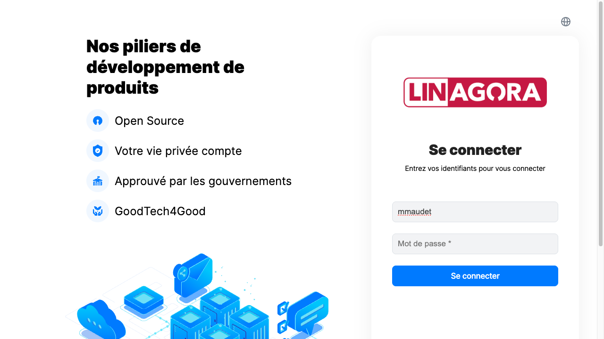

---

## Aide-mémoire

### Commandes vault

| Commande | Description |
|----------|-------------|
| `browserlet vault init` | Créer le vault avec un mot de passe maître |
| `browserlet vault add <alias>` | Ajouter un credential |
| `browserlet vault del <alias>` | Supprimer un credential |
| `browserlet vault list` | Lister les alias enregistrés |
| `browserlet vault import-from-extension` | Importer depuis l'extension Chrome |
| `browserlet vault lock` | Verrouiller le vault |
| `browserlet vault reset` | Supprimer le vault |

### Flags CLI — `browserlet run`

| Flag | Description |
|------|-------------|
| `--headed` | Navigateur visible |
| `--vault` | Activer le vault |
| `--timeout <ms>` | Timeout par étape |
| `--output-dir <dir>` | Répertoire de sortie |
| `--micro-prompts` | Micro-prompts LLM |
| `--auto-repair` | Réparation automatique |
| `--interactive` | Réparation interactive |
| `--session-restore <id>` | Restaurer une session |
| `--diagnostic-json` | Diagnostics JSON |

### Flags CLI — `browserlet test`

| Flag | Description |
|------|-------------|
| `--workers <n>` | Workers parallèles |
| `--bail` | Arrêter au premier échec |
| *(+ tous les flags de `run`)* | |

### Syntaxe credential dans BSL

```yaml
value: "{{credential:MON_ALIAS}}"
```

### Actions BSL disponibles

| Action | Description |
|--------|-------------|
| `navigate` | Ouvrir une URL |
| `click` | Cliquer sur un élément |
| `type` | Saisir du texte |
| `select` | Choisir dans un menu déroulant |
| `wait_for` | Attendre un élément ou une condition |
| `extract` | Extraire du texte |
| `table_extract` | Extraire un tableau HTML |
| `screenshot` | Capturer la page |
| `hover` | Survoler un élément |
| `scroll` | Défiler vers un élément |
